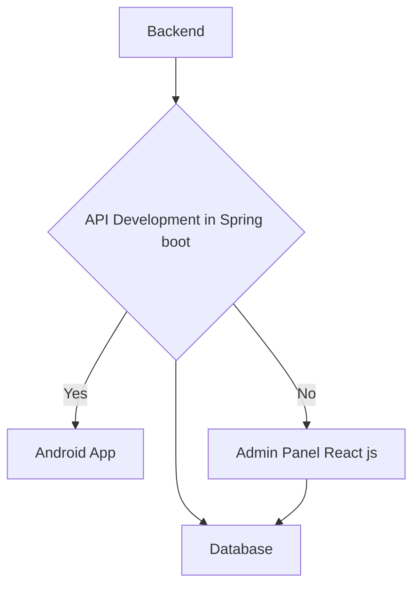
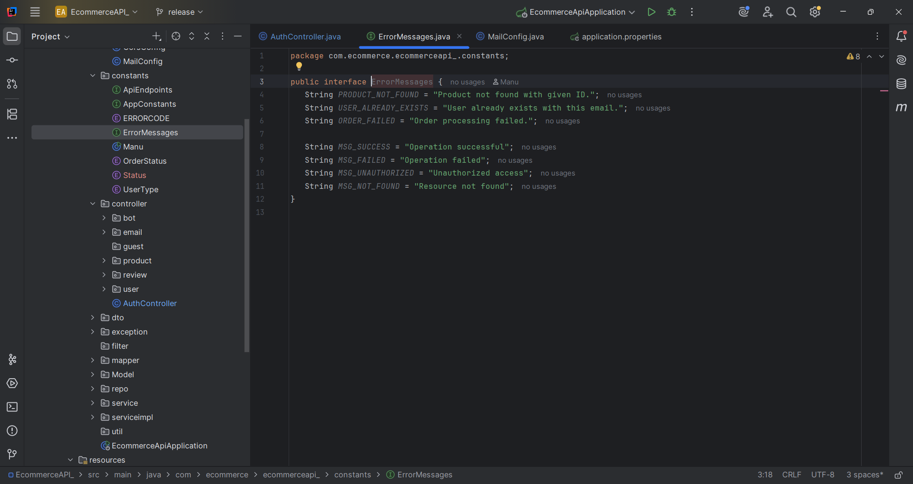
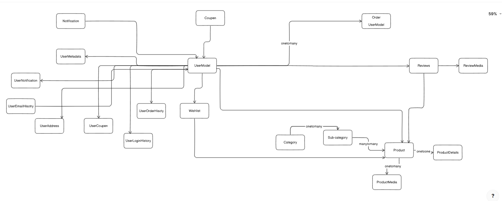

# Full stack Ecommerce Application
A complete ***E-Commerce System*** built with a modern full-stack architecture using **Android (Frontend App)**, **React.js (Admin Panel)**, **Spring Boot (Backend)**, and **MySQL (Database)**.
This project demonstrates a robust, scalable, and real-world ready e-commerce ecosystem covering customer shopping experience, admin product management, and secure backend APIs.

# Extra fetaures is that i am enabled GenAi featuresbthat help to purshase modals based cloths and also virtual wold clotheing review panels and suggestions best of the proeuct

## Tech Stack OverView
<table style="width: 80%; margin: 30px auto; border-collapse: collapse; background-color: #fff; box-shadow: 0 2px 10px rgba(0,0,0,0.1); border-radius: 10px; overflow: hidden;">
    <thead style="background-color: #007bff; color: white;">
      <tr>
        <th style="padding: 15px; text-align: left; font-size: 16px;">Layer</th>
        <th style="padding: 15px; text-align: left; font-size: 16px;">Technology</th>
        <th style="padding: 15px; text-align: left; font-size: 16px;">Description</th>
      </tr>
    </thead>
    <tbody>
      <tr style="border-bottom: 1px solid #ddd;">
        <td style="padding: 12px;">Frontend (User App)</td>
        <td style="padding: 12px;">Android (Java/Kotlin)</td>
        <td style="padding: 12px;">Customer-facing mobile application with product browsing, cart, orders, and payment.</td>
      </tr>
      <tr style="background-color: #f2f2f2; border-bottom: 1px solid #ddd;">
        <td style="padding: 12px;">Frontend (Admin Panel)</td>
        <td style="padding: 12px;">React.js</td>
        <td style="padding: 12px;">Web dashboard for product, category, and order management.</td>
      </tr>
      <tr style="border-bottom: 1px solid #ddd;">
        <td style="padding: 12px;">Backend (API)</td>
        <td style="padding: 12px;">Spring Boot (Java)</td>
        <td style="padding: 12px;">RESTful APIs for user authentication, order handling, and data persistence.</td>
      </tr>
      <tr style="background-color: #f2f2f2; border-bottom: 1px solid #ddd;">
        <td style="padding: 12px;">Database</td>
        <td style="padding: 12px;">MySQL</td>
        <td style="padding: 12px;">Relational database for storing user, product, and transaction data.</td>
      </tr>
      <tr style="border-bottom: 1px solid #ddd;">
        <td style="padding: 12px;">Payment Gateway</td>
        <td style="padding: 12px;">Razorpay</td>
        <td style="padding: 12px;">Secure payment integration for seamless checkout.</td>
      </tr>
      <tr style="background-color: #f2f2f2;">
        <td style="padding: 12px;">Authentication</td>
        <td style="padding: 12px;">JWT Tokens</td>
        <td style="padding: 12px;">Secure login/signup and API access using JSON Web Tokens.</td>
      </tr>
    </tbody>
  </table>


<!-- ##  Task Lists
- [x] Write tutorial  
- [x] Drink coffee  
- [ ] Push to GitHub  -->


### System Architecture
All layers communicate by secure ***REST APIs***. The backend validates requests and serves data to both **Android** and **React admin** interfaces.



### 📱 Android Application
***Features***
1. User Registration & Login (JWT based)
2. Product Browsing (Category-wise)
3. Add to Cart / Remove from Cart
4. Order Placement and Tracking
5. Razorpay Payment Integration
6. OTP Verification for Login
7. Responsive and Minimal UI

***Tech-stack***
- **Language**: Java (or Kotlin)
- **Architecture**: MVVM + Repository Pattern
- **Networking**: Retrofit2 + Gson
- **Async Tasks**: WorkManager / Coroutines
- **Local Cache**: Room Database
- **Dependency Injection**: Dagger/Hilt
- **UI**: Material Design Components

***Screens***
---
---
- #### home screen
---
 <br/>

---
- #### Add to Cart screen
---
 <br/>

---
- #### Profile screen
---
 <br/>

---
- #### Searchbar screen
---
 <br/>

---
- #### Video Section screen
---
 <br/>

---
- #### View Product screen
---
 <br/>

---
- #### View Product screen
---
 <br/>

---
- #### View Product screen
---
 <br/>


---
# 🧑‍💼 React Admin Panel

#### Purpose
The Admin Dashboard allows store owners to manage products, categories, and orders efficiently.
#### ✨ Features
- Admin Authentication
- Product CRUD (Create, Read, Update, Delete)
- Category Management
- Order Overview (Pending / Completed / Cancelled)
- Sales Insights Dashboard
- API Integration with Spring Boot backend
#### 🧰 Tech Stack
- React.js
- Axios for API calls
- React Router DOM for navigation
- Tailwind CSS / Material UI for styling
- Chart.js / Recharts for analytics
- Tanstack

---
# ⚙️ Backend (Spring Boot)
Backend system help to connect and manage the datbaase operation and providing the security and we can create custom features using Backend System (Image management , Video Management , orders).




#### ✨ Features
- User and Admin Authentication (JWT)
- Product, Category, and Order APIs
- OTP Generation & Validation for Login
- Integration with Razorpay for payment
- Exception Handling and Input Validation
- One-to-Many and Many-to-One Mappings
- DTO pattern for request/response separation

🧩 Project Structure
```
src/
|-config 
|      |---CorsConfig.java
|      |---MainConfig
|      |---BotConfig
|- constants
|      |--- APIENDPOINTS.java
|      |---APICONSTANTS.java
|      |---ERRORCODE.java
|      |--- ErrorMessage.java
|      |--- OrderStatus.java
|      |--- Status.java
|      |--- UserType
|-controller
|      |--- AuthController.java
|      |---BotController.java
|      |---EmailController.java
|      |---ProductController.java
|      |---ReviewController.java
|      |--- UserController.java
|      |--- OrderController.java
|      |--PaymentController.java
|-- dTO
|      |-- requestsDTO/
|      |       |-- more classes      
|      |--- responseDTO/
|      |       |-- more response classes
|
|- exception
       |- controlleradvice/
       |       |-- GlobalExceptionHandler.java
       |       |-- ErrorModel.java
|      |-- custom-exception/
|- fIlters /
|- mappers /
|- models /
|- repo /
|- service /
|- serviceimpl /
|- util /more
|- mediahandler /more
|- paymenthandler /more
|- manager /more
|- apicode /more

```

#### 🧰 Dependencies
- Spring Boot Starter Web
- Spring Boot Starter JPA
- Redis
- razorpay
- Spring Security (JWT)
- MySQL Connector
- Lombok
- Validation API
- Gemini API


#### API ENDPOINTS
<table style="width: 80%; margin: 30px auto; border-collapse: collapse; background-color: #fff; box-shadow: 0 2px 10px rgba(0,0,0,0.1); border-radius: 10px; overflow: hidden;">
    <thead style="background-color: #ffb300ff; color: white;">
      <tr>
        <th style="padding: 15px; text-align: left; font-size: 16px;">METHOD</th>
        <th style="padding: 15px; text-align: left; font-size: 16px;">ENDPOINTS</th>
        <th style="padding: 15px; text-align: left; font-size: 16px;">Description</th>
      </tr>
    </thead>
    <tbody>
      <tr style="border-bottom: 1px solid #ddd;">
        <td style="padding: 12px;">POST</td>
        <td style="padding: 12px;">/auth/login</td>
        <td style="padding: 12px;">Login and get JWT token</td>
      </tr>
      <tr style="border-bottom: 1px solid #ddd;">
        <td style="padding: 12px;">POST</td>
        <td style="padding: 12px;">/auth/login/forget-password</td>
        <td style="padding: 12px;">forget request by user</td>
      </tr>
      <tr style="border-bottom: 1px solid #ddd;">
        <td style="padding: 12px;">POST</td>
        <td style="padding: 12px;">/auth/login/reset-password</td>
        <td style="padding: 12px;">show all Rest-Page and get details</td>
      </tr>
       <tr style="border-bottom: 1px solid #ddd;">
        <td style="padding: 12px;">POST</td>
        <td style="padding: 12px;">/auth/register</td>
        <td style="padding: 12px;">Register and get JWT token</td>
      </tr>
       <tr style="border-bottom: 1px solid #ddd;">
        <td style="padding: 12px;">POST</td>
        <td style="padding: 12px;">/auth/register/otp</td>
        <td style="padding: 12px;">send otp on phone for Mobile validation</td>
      </tr>
       <tr style="border-bottom: 1px solid #ddd;">
        <td style="padding: 12px;">POST</td>
        <td style="padding: 12px;">/auth/register/email-validation/${uuid}</td>
        <td style="padding: 12px;">user validation using email</td>
      </tr>
       <tr style="border-bottom: 1px solid #ddd;">
        <td style="padding: 12px;">POST</td>
        <td style="padding: 12px;">/api/products/**</td>
        <td style="padding: 12px;">manage product , wishlist , payment</td>
      </tr>
      <tr style="border-bottom: 1px solid #ddd;">
        <td style="padding: 12px;">POST</td>
        <td style="padding: 12px;">/api/category/**</td>
        <td style="padding: 12px;">get all category by products and sub-category apis</td>
      </tr>
      <tr style="border-bottom: 1px solid #ddd;">
        <td style="padding: 12px;">POST</td>
        <td style="padding: 12px;">/api/profile/**</td>
        <td style="padding: 12px;">Here manage profile and thier related task</td>
      </tr>
      <tr style="border-bottom: 1px solid #ddd;">
        <td style="padding: 12px;">POST</td>
        <td style="padding: 12px;">/api/profile/user/**</td>
        <td style="padding: 12px;">User and User Related APIs</td>
      </tr>    
    </tbody>
  </table>

  ## Database
  #### Schema Highlights



# Setup Instructions
### 🔹 Prerequisites
- JDK 17+
- Node.js 18+
- MySQL 8+
- Android Studio (latest)
- Maven or Gradle

### 🔹 Backend Setup
```
cd EcommAPI/EcommerceAPI_/
mvn clean install
mvn spring-boot:run
```

### 🔹 Database Setup
```
CREATE DATABASE ecommerce_app;
```

### 🔹 Update Application.properties file
```
#############################################
# 🌐 SERVER CONFIGURATION
#############################################
server.port=8080
server.servlet.context-path=/api
spring.application.name=ecommerce-app

#############################################
# 💾 DATABASE CONFIGURATION (MySQL)
#############################################
spring.datasource.url=jdbc:mysql://localhost:3306/ecommerce_db?useSSL=false&allowPublicKeyRetrieval=true&serverTimezone=UTC
spring.datasource.username=root
spring.datasource.password=your_password
spring.datasource.driver-class-name=com.mysql.cj.jdbc.Driver

# Hibernate / JPA
spring.jpa.hibernate.ddl-auto=update
spring.jpa.show-sql=true
spring.jpa.properties.hibernate.format_sql=true
spring.jpa.properties.hibernate.dialect=org.hibernate.dialect.MySQL8Dialect

#############################################
# 📧 EMAIL CONFIGURATION (SMTP)
#############################################
spring.mail.host=smtp.gmail.com
spring.mail.port=587
spring.mail.username=your_email@gmail.com
spring.mail.password=your_app_password
spring.mail.properties.mail.smtp.auth=true
spring.mail.properties.mail.smtp.starttls.enable=true
spring.mail.properties.mail.smtp.connectiontimeout=5000
spring.mail.properties.mail.smtp.timeout=5000
spring.mail.properties.mail.smtp.writetimeout=5000
spring.mail.default-encoding=UTF-8

#############################################
# 🔐 JWT SECURITY CONFIG
#############################################
jwt.secret=your_jwt_secret_key
jwt.expiration=86400000  # 1 day in milliseconds

#############################################
# 🧠 REDIS CONFIGURATION
#############################################
spring.data.redis.host=localhost
spring.data.redis.port=6379
spring.data.redis.password=
spring.data.redis.timeout=60000

#############################################
# 📨 KAFKA CONFIGURATION
#############################################
spring.kafka.bootstrap-servers=localhost:9092

# Producer Configuration
spring.kafka.producer.key-serializer=org.apache.kafka.common.serialization.StringSerializer
spring.kafka.producer.value-serializer=org.apache.kafka.common.serialization.StringSerializer
spring.kafka.producer.acks=all
spring.kafka.producer.retries=3

# Consumer Configuration
spring.kafka.consumer.group-id=ecommerce-group
spring.kafka.consumer.auto-offset-reset=earliest
spring.kafka.consumer.key-deserializer=org.apache.kafka.common.serialization.StringDeserializer
spring.kafka.consumer.value-deserializer=org.apache.kafka.common.serialization.StringDeserializer
spring.kafka.listener.missing-topics-fatal=false

#############################################
# 🪣 FILE UPLOAD CONFIGURATION
#############################################
spring.servlet.multipart.max-file-size=10MB
spring.servlet.multipart.max-request-size=10MB

#############################################
# 🌍 LOGGING CONFIGURATION
#############################################
logging.level.root=INFO
logging.level.org.springframework.web=DEBUG
logging.file.name=logs/ecommerce-app.log
logging.pattern.console=%d{yyyy-MM-dd HH:mm:ss} - %msg%n

#############################################
# 🧩 OTHER COMMON SETTINGS
#############################################
spring.main.allow-bean-definition-overriding=true
spring.main.banner-mode=off
```

### 🔹 React Admin Setup
```
cd ecoomweb/
npm install
npm start
```

### 🔒 Security
- JWT Authentication & Authorization
- Secure Password Hashing (BCrypt)
- Role-based access (User/Admin)
- Input Validation and Exception Handling
- CORS Configuration for multi-origin access

### 💳 Payment Gateway Integration
- Integrated Razorpay SDK for Android
- Secure server-side verification through Spring Boot
- Handles success/failure callbacks gracefully


# 📊 Future Improvements
- Implement inventory management
- Introduce AI-based product recommendations
- Multi-vendor marketplace support
- Machine Learning

### Author
***Manu Pathak***
Full Stack Developer | Tech Explorer    

### License
This project is licensed under the MIT License — you’re free to use, modify, and distribute it.
